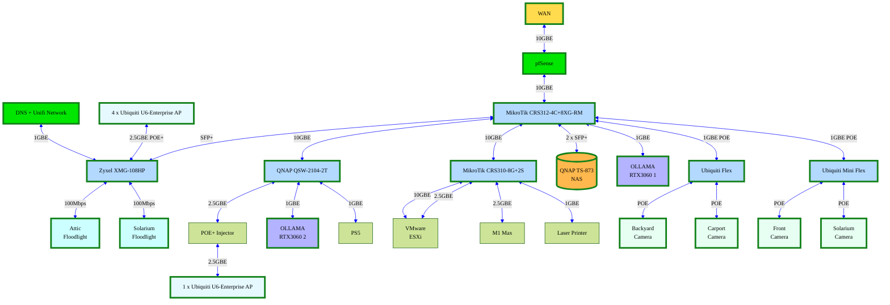

```mermaid
%%{init: {'theme': 'forest', "loglevel":1,'themeVariables': {'lineColor': 'Blue', 'fontSize':'14px',"fontFamily": "Trebuchet MS"}}}%%
flowchart TD

style G fill:#00e600,stroke:#13821a,stroke-width:4px
style F fill:#e6f9ff,stroke:#13821a,stroke-width:4px
style FA fill:#e6f9ff,stroke:#13821a,stroke-width:4px
style B fill:#b3d9ff,stroke:#13821a,stroke-width:4px
style QNAP fill:#ffb84d,stroke:#13821a,stroke-width:4px
style C fill:#b3d9ff,stroke:#13821a,stroke-width:4px
style D fill:#b3d9ff,stroke:#13821a,stroke-width:4px
style E fill:#b3d9ff,stroke:#13821a,stroke-width:4px
style H fill:#b3d9ff,stroke:#13821a,stroke-width:4px
style J fill:#b3d9ff,stroke:#13821a,stroke-width:4px
style A fill:#00e600,stroke:#13821a,stroke-width:4px
style FL1 fill:#ccffff,stroke:#13821a,stroke-width:4px
style FL2 fill:#ccffff,stroke:#13821a,stroke-width:4px
style CAM1 fill:#e6fff2,stroke:#13821a,stroke-width:4px
style CAM2 fill:#e6fff2,stroke:#13821a,stroke-width:4px
style CAM3 fill:#e6fff2,stroke:#13821a,stroke-width:4px
style CAM4 fill:#e6fff2,stroke:#13821a,stroke-width:4px
style Z fill:#ffdb4d,stroke:#13821a,stroke-width:4px
style GPU1 fill:#b3b3ff,stroke:#13821a,stroke-width:4px
style GPU2 fill:#b3b3ff,stroke:#13821a,stroke-width:4px


Z[WAN]
A[pfSense]
B[Zyxel XMG-108HP]
C[MikroTik CRS312-4C+8XG-RM]
D[QNAP QSW-2104-2T]
E[MikroTik CRS310-8G+2S]
F[1 x Ubiquiti U6-Enterprise AP]
FA[4 x Ubiquiti U6-Enterprise AP]
FB[POE+ Injector]
G[DNS + Unifi Network]
H[Ubiquiti Mini Flex]
J[Ubiquiti Flex]
HA[VMware
ESXi]
HB[M1 Max]
HC[Laser Printer]
QNAP[(QNAP TS-873
NAS)]
GPU1[OLLAMA
RTX3060 1]
GPU2[OLLAMA
RTX3060 2]
PS5[PS5]
FL1[Attic
Floodlight]
FL2[Solarium
Floodlight]
CAM1[Front
Camera]
CAM2[Solarium
Camera]
CAM3[Backyard
Camera]
CAM4[Carport
Camera]


Z <--10GBE--> A
A <--10GBE--> C

C <--SFP+--> B
B <--100Mbps--> FL1
B <--100Mbps--> FL2
C <--10GBE--> D
C <--10GBE--> E
C <--2 x SFP+--> QNAP
FA <--2.5GBE POE+--> B
G <--1GBE--> B
D <--2.5GBE--> FB <--2.5GBE--> F
E <--10GBE--> HA
E <--2.5GBE--> HA
E <--2.5GBE--> HB
E <--1GBE--> HC
C <--1GBE--> GPU1
C <--1GBE POE--> J
J <--POE--> CAM3
J <--POE--> CAM4
C <--1GBE POE--> H
H <--POE--> CAM1
H <--POE--> CAM2
D <--1GBE--> GPU2
D <--1GBE--> PS5
```

