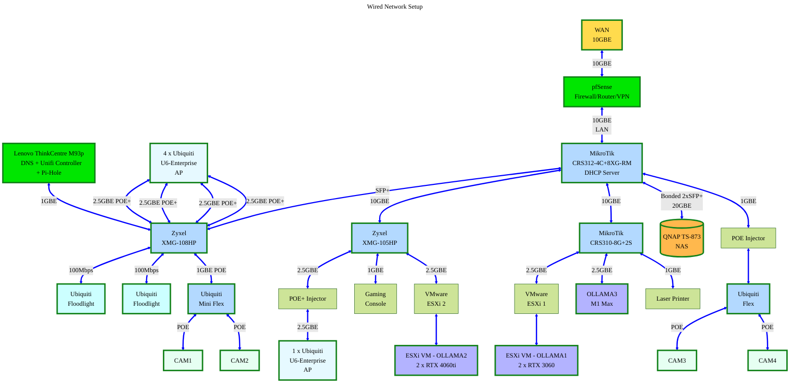

```mermaid
---
title: Wired Network Setup
---

%%{init: {'theme': 'forest', "loglevel":1,'themeVariables': {'lineColor': 'Blue', 'fontSize':'18px',"fontFamily": "Trebuchet MS"}}}%%

flowchart TD

    style G fill:#00e600,stroke:#13821a,stroke-width:4px
    style F fill:#e6f9ff,stroke:#13821a,stroke-width:4px
    style FA fill:#e6f9ff,stroke:#13821a,stroke-width:4px
    style B fill:#b3d9ff,stroke:#13821a,stroke-width:4px
    style QNAP fill:#ffb84d,stroke:#13821a,stroke-width:4px
    style C fill:#b3d9ff,stroke:#13821a,stroke-width:4px
    style D fill:#b3d9ff,stroke:#13821a,stroke-width:4px
    style E fill:#b3d9ff,stroke:#13821a,stroke-width:4px
    style H fill:#b3d9ff,stroke:#13821a,stroke-width:4px
    style J fill:#b3d9ff,stroke:#13821a,stroke-width:4px
    style A fill:#00e600,stroke:#13821a,stroke-width:4px
    style FL1 fill:#ccffff,stroke:#13821a,stroke-width:4px
    style FL2 fill:#ccffff,stroke:#13821a,stroke-width:4px
    style CAM1 fill:#e6fff2,stroke:#13821a,stroke-width:4px
    style CAM2 fill:#e6fff2,stroke:#13821a,stroke-width:4px
    style CAM3 fill:#e6fff2,stroke:#13821a,stroke-width:4px
    style CAM4 fill:#e6fff2,stroke:#13821a,stroke-width:4px
    style Z fill:#ffdb4d,stroke:#13821a,stroke-width:4px
    style GPU1 fill:#b3b3ff,stroke:#13821a,stroke-width:4px
    style GPU2 fill:#b3b3ff,stroke:#13821a,stroke-width:4px
    style HB fill:#b3b3ff,stroke:#13821a,stroke-width:4px


    Z[WAN
    10GBE]

    A[pfSense
    Firewall/Router/VPN]

    B[Zyxel
    XMG-108HP]
    C[MikroTik
    CRS312-4C+8XG-RM
    DHCP Server]
    E[MikroTik
    CRS310-8G+2S]
    D[Zyxel
    XMG-105HP]
  
    F[1 x Ubiquiti
    U6-Enterprise
    AP]
    FA[4 x Ubiquiti
    U6-Enterprise
    AP]

    FB[POE+ Injector]
    FC[POE Injector]
    G[Lenovo ThinkCentre M93p
    DNS + Unifi Controller + Pi-Hole]
    H[Ubiquiti
    Mini Flex]
    J[Ubiquiti
    Flex]
    HA[VMware
    ESXi 1]
    HA2[VMware
    ESXi 2]
    HB[OLLAMA3
    M1 Max]
    HC[Laser Printer]
    QNAP[(QNAP TS-873
    NAS)]
    GPU1[ESXi VM - OLLAMA1
    2 x RTX 3060]
    GPU2[ESXi VM - OLLAMA2
    2 x RTX 4060ti]
    PS5[Gaming
    Console]
    FL1[Ubiquiti
    Floodlight]
    FL2[Ubiquiti
    Floodlight]
    CAM1[CAM1]
    CAM2[CAM2]
    CAM3[CAM3]
    CAM4[CAM4]

    Z <==10GBE==> A
    A <==10GBE
    LAN==> C

    C <==SFP+==> B
    B <==100Mbps==> FL1
    B <==100Mbps==> FL2
    C <==10GBE==> D
    C <==10GBE==> E
    C <==Bonded 2xSFP+
    20GBE==> QNAP

    G <==1GBE==> B
    D <==2.5GBE==> FB <==2.5GBE==> F
    E <==2.5GBE==> HA
    E <==2.5GBE==> HB
    E <==1GBE==> HC
    HA <==> GPU1
    C <==1GBE==> FC <==> J
    J <==POE==> CAM3
    J <==POE==> CAM4
    B <==1GBE POE==> H
    H <==POE==> CAM1
    H <==POE==> CAM2
    HA2 <==> GPU2
    D <==1GBE==> PS5
    D <==2.5GBE==> HA2
    FA <==2.5GBE POE+==> B
    FA <==2.5GBE POE+==> B
    FA <==2.5GBE POE+==> B
    FA <==2.5GBE POE+==> B

```

